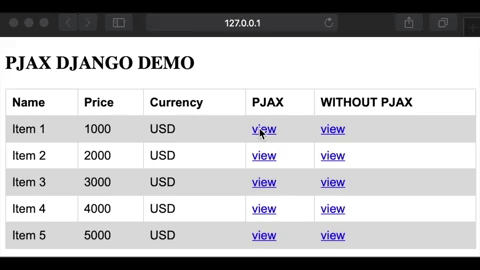

### How to run
#### Install dependencies
```
pip install -r requirements.txt
```
#### For flask project
```
cd pjax_flask
flask run
```
Go to `http://127.0.0.1:5000` and result like picture below


#### For django project
```
cd pjax_django
python manage.py runserver 
```
Go to `http://127.0.0.1:8000/pjax` and result like picture below
